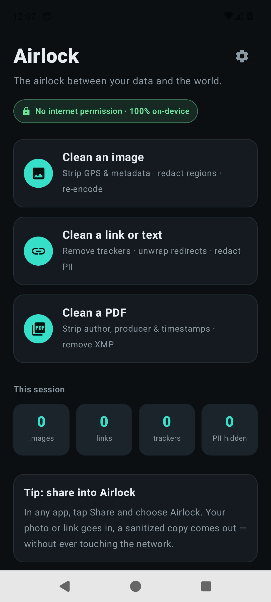
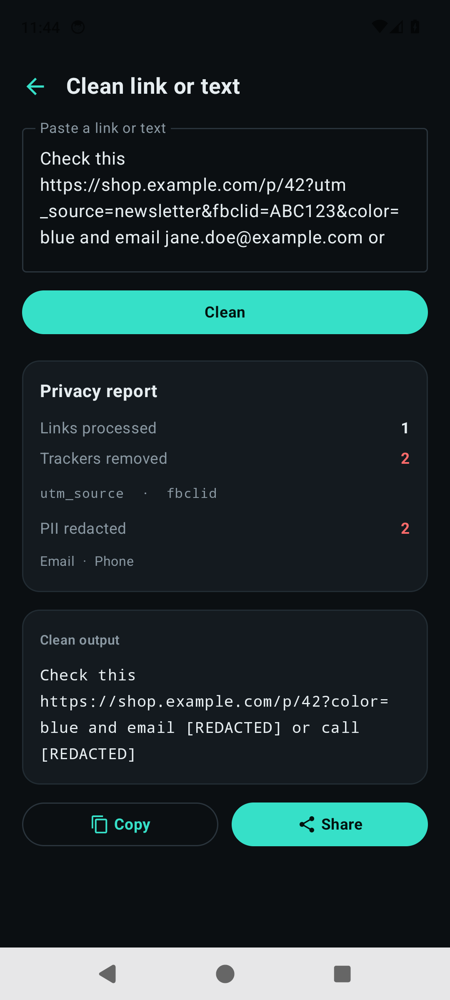
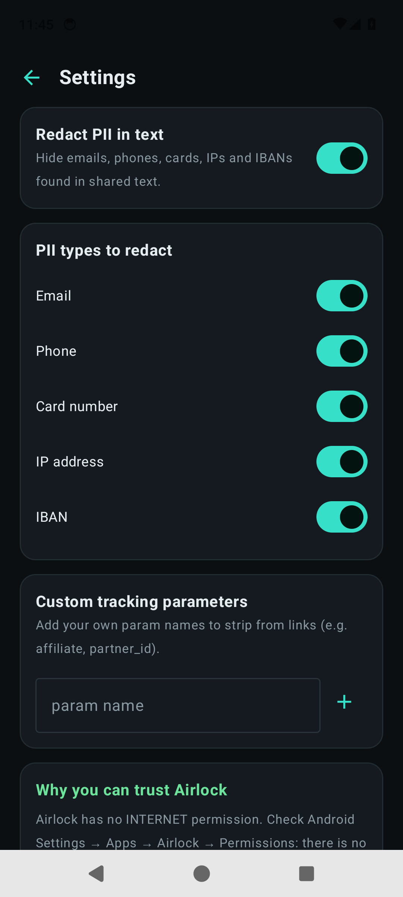

<div align="center">

# 🔒 Airlock

**The airlock between your data and the world.**

Strip GPS & metadata from photos, irreversibly redact regions, and clean tracking
parameters out of links — **100% on-device, with no internet permission at all.**

[](LICENSE)


</div>

---

## Why Airlock exists

Every time you share a photo, a screenshot, or a link, you leak more than you meant to:

- **Photos** carry EXIF data — your exact GPS coordinates, the time, your phone model.
- **Screenshots** show names, faces, card numbers. "Blur" and "crop" tools are often
  *reversible* (remember the Acropalypse bug).
- **Links** are stuffed with `utm_*`, `fbclid`, `gclid` trackers and redirect wrappers
  that follow you across the web.

Existing tools each fix **one** slice, are scattered, and many request network access — so
you have to *trust* them not to phone home.

Airlock does all three, in one place, and removes the need for trust entirely.

## The guarantee you can verify

**Airlock declares no `android.permission.INTERNET`.** It is *structurally incapable* of
sending your data anywhere. Don't take our word for it:

```bash
# Inspect the built APK yourself:
aapt2 dump permissions app-debug.apk | grep INTERNET   # → (nothing)
```

Or on your phone: **Settings → Apps → Airlock → Permissions** — there is no network
permission to grant.

## What it does

| | Engine | What happens |
|---|---|---|
| 🖼️ | **Metadata destruction** | Re-encodes the pixels, dropping **all** metadata (EXIF, XMP, IPTC, maker notes) — not just the tags we know about. Orientation is baked in first so the photo stays upright. |
| ⬛ | **Irreversible redaction** | Drag to paint black boxes; the underlying pixels are **destroyed** in the bitmap, then flattened. No recoverable layer. |
| 🔗 | **Link de-tracking** | Strips tracking params, unwraps offline-decodable redirect wrappers (Google, DuckDuckGo, Facebook, Messenger, Reddit, LinkedIn, Tumblr, Slack, Outlook SafeLinks, affiliate networks, …). Never unwraps `bit.ly`/`t.co` — that would need a network request, which Airlock never makes. |
| 🆔 | **PII redaction** | Finds and hides emails, phone numbers, Luhn-valid cards, IPs and mod-97-valid IBANs in shared text. |
| 📄 | **PDF metadata stripping** | Removes the PDF Info dictionary (Author, Producer, Creator, timestamps) and the XMP metadata stream, fully offline via PDFBox-Android. |

It plugs into Android where it matters: the **Share sheet** (single + batch images, text, PDFs),
and the **text-selection menu** (PROCESS_TEXT). Share in → sanitized copy out.

<div align="center">

&nbsp;&nbsp;

&nbsp;&nbsp;

</div>

## Architecture

Two modules, clean separation, easy to test:

```
airlock/
├── airlock-core/        Pure-Kotlin JVM library — no Android deps
│   ├── LinkScrubber      tracker stripping + offline redirect unwrapping
│   ├── PiiDetector       regex + Luhn + mod-97 validation
│   └── ScrubRules        the rule set (data, not code → testable & extensible)
└── app/                 Android (Jetpack Compose)
    ├── scrub/ImageScrubber   EXIF read, orientation bake, pixel redaction, re-encode
    ├── scrub/PdfScrubber      PDF Info-dictionary + XMP metadata removal (PDFBox-Android)
    ├── intent/ShareIntents   build outgoing share intents
    ├── data/Settings         DataStore (key-value file — no database)
    └── ui/                    Compose screens + theme
```

- **No database.** Settings live in a DataStore key-value file. Nothing you scrub is ever
  persisted; the export cache is wiped on every launch.
- **No Google Play Services, no ML blobs, no proprietary dependencies.**
- **Images are picked via the Android Photo Picker**, so Airlock needs no storage permission either.

## Build & run

Requirements: JDK 17, Android SDK with platform 34 + build-tools 34.

```bash
git clone <your-fork-url> airlock && cd airlock
echo "sdk.dir=/path/to/your/Android/Sdk" > local.properties

# Run the logic tests (fast, pure JVM):
./gradlew :airlock-core:test

# Build a debug APK:
./gradlew :app:assembleDebug
# → app/build/outputs/apk/debug/app-debug.apk

# Install on a connected device/emulator:
./gradlew :app:installDebug
# or: adb install -r app/build/outputs/apk/debug/app-debug.apk
```

### Signed release build

Create a keystore and a (gitignored) `keystore.properties` at the repo root:

```bash
keytool -genkeypair -v -keystore ~/.android-keystores/airlock-release.jks \
  -alias airlock -keyalg RSA -keysize 4096 -validity 10000

cat > keystore.properties <<'EOF'
storeFile=/absolute/path/to/airlock-release.jks
storePassword=...
keyAlias=airlock
keyPassword=...
EOF

./gradlew :app:assembleRelease    # → app/build/outputs/apk/release/app-release.apk
```

Without `keystore.properties` the release task still builds an unsigned APK. Prebuilt signed
APKs are attached to each [GitHub Release](https://github.com/dekimuhq/airlock/releases).

### Try the share flow

Open any gallery or browser, tap **Share**, and choose **Airlock**. Or from a terminal:

```bash
adb shell am start -a android.intent.action.SEND -t text/plain \
  --es android.intent.extra.TEXT \
  'https://example.com/p?utm_source=x&fbclid=y and jane@example.com' \
  -n com.airlock.debug/com.airlock.MainActivity
```

## Tests

| Suite | Command | Proves |
|---|---|---|
| Core unit tests (28) | `./gradlew :airlock-core:test` | Tracker stripping, redirect unwrapping (12+ wrapper hosts), PII detection/validation |
| Instrumented (6) | `./gradlew :app:connectedDebugAndroidTest` | EXIF is destroyed on a real device, redaction destroys pixels, PDF Info+XMP metadata removed, outputs are shareable content URIs |

## Privacy

Airlock collects nothing, stores nothing, and sends nothing. See [docs/PRIVACY.md](docs/PRIVACY.md).

## License

[Apache-2.0](LICENSE). Contributions welcome — see [CONTRIBUTING.md](CONTRIBUTING.md).
